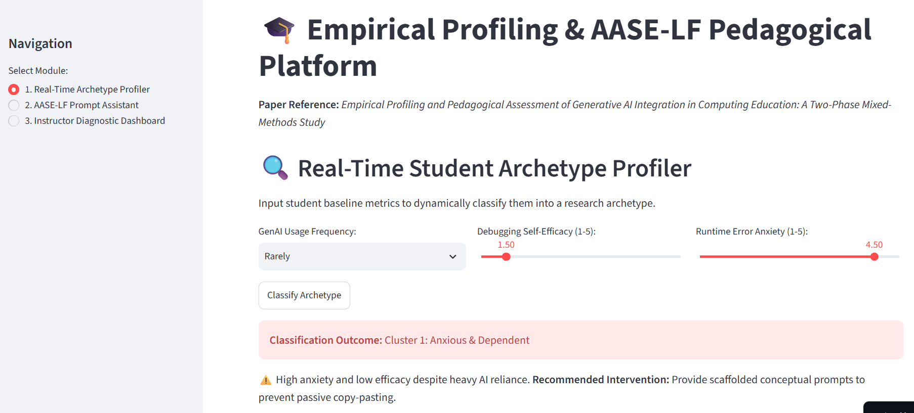
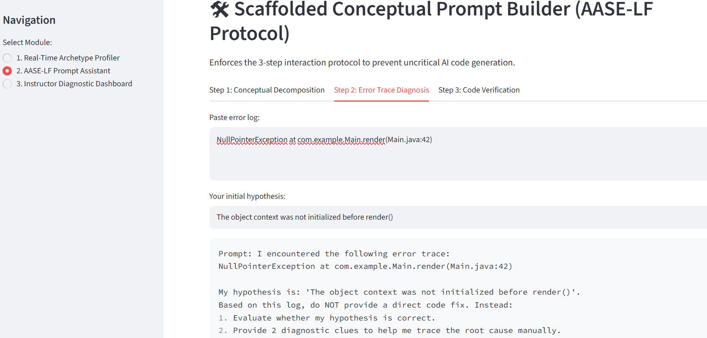
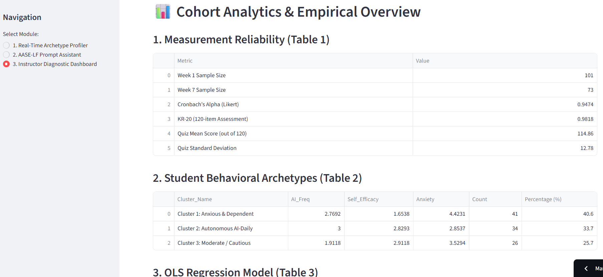
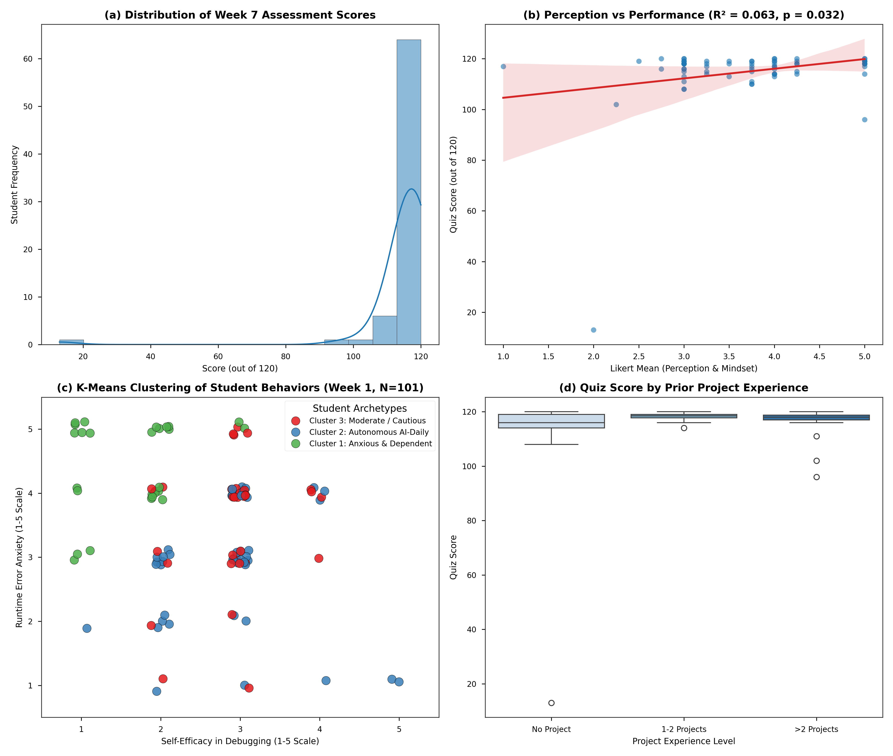
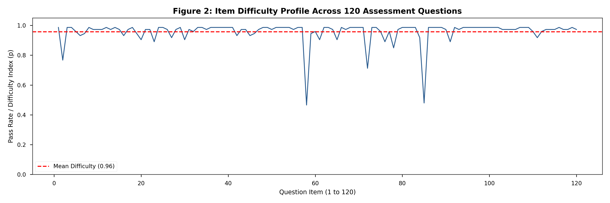

# Empirical Profiling and Pedagogical Assessment of Generative AI Integration in Computing Education: A Two-Phase Mixed-Methods Study

[](#) 
[](https://aase-lf-genai-analytics-frbjnmkblqnhwlzlfeag2w.streamlit.app/) 
[](https://www.python.org/)
[](LICENSE)

Official repository and interactive demonstration platform for the paper **"Empirical Profiling and Pedagogical Assessment of Generative AI Integration in Computing Education: A Two-Phase Mixed-Methods Study"**.

---

## 📌 Executive Summary

Generative Artificial Intelligence (GenAI) has fundamentally reshaped software engineering education, yet its impact on student debugging anxiety, self-efficacy, and conceptual mastery remains highly heterogeneous. This study conducts a two-phase empirical evaluation ($N_1 = 101$, $N_2 = 73$) tracking an undergraduate software engineering cohort across a 7-week intervention:

1. **Phase 1 — Profiling (Week 1):** Applied $K$-Means clustering ($k=3$) on onboarding diagnostic data ($N_1 = 101$) to identify three distinct behavioral archetypes: *Anxious & Dependent* ($40.6\%$), *Autonomous AI-Daily* ($33.7\%$), and *Moderate / Cautious* ($25.7\%$).
2. **Phase 2 — Evaluation (Week 7):** Evaluated domain mastery via a 120-item binary assessment ($N_2 = 73$, $KR\text{-}20 = 0.9818$). OLS linear regression established that positive GenAI learning perceptions significantly predict academic performance ($\beta = 3.8179, p = 0.0321$).
3. **Pedagogical Equity:** A Kruskal-Wallis non-parametric test ($H = 4.2774, p = 0.1178$) confirmed no statistically significant performance variation across prior project experience levels under our scaffolded prompting framework (AASE-LF).

---

## 🏗️ Architecture & Methodological Pipeline

The analytical pipeline spans three integrated phases: onboarding behavioral profiling, summative evaluation, and real-time interactive system deployment:
+-----------------------------------------------------------------------------------+
|                            PHASE 1: PROFILING (Week 1)                            |
|  [Onboarding Diagnostic (N1=101)] ---> [K-Means Clustering] ---> [3 Archetypes]  |
+-----------------------------------------------------------------------------------+
|
v
+-----------------------------------------------------------------------------------+
|                           PHASE 2: EVALUATION (Week 7)                            |
|  [AASE-LF Protocol] ---> [120-Item Quiz (N2=73)] ---> [OLS & Kruskal-Wallis Test] |
+-----------------------------------------------------------------------------------+
|
v
+-----------------------------------------------------------------------------------+
|                                SYSTEM DEPLOYMENT                                  |
|  [Instructor Diagnostic Dashboard] <---> [Streamlit Real-Time Profiler & Prompt]  |
+-----------------------------------------------------------------------------------+

---

## 🚀 Interactive Streamlit Application & GUI Demo

The empirical findings are operationalized into an open-source Streamlit application providing real-time student profiling, scaffolded prompt engineering, and cohort diagnostic analytics.

🌐 **[Launch Live Web Application](https://aase-lf-genai-analytics-frbjnmkblqnhwlzlfeag2w.streamlit.app/)**

### Application Modules Showcase

| 1. Real-Time Student Archetype Profiler | 2. AASE-LF Scaffolded Prompt Assistant |
| :---: | :---: |
| [](https://aase-lf-genai-analytics-frbjnmkblqnhwlzlfeag2w.streamlit.app/) | [](https://aase-lf-genai-analytics-frbjnmkblqnhwlzlfeag2w.streamlit.app/) |
| *Inputs usage metrics, self-efficacy, and anxiety to classify students (e.g., Cluster 1) and output pedagogical interventions.* | *Enforces 3-step scaffolded interaction protocol: Conceptual Decomposition, Error Trace Diagnosis, and Code Verification.* |

<br>

| 3. Instructor Diagnostic Dashboard |
| :---: |
| [](https://aase-lf-genai-analytics-frbjnmkblqnhwlzlfeag2w.streamlit.app/) |
| *Displays cohort reliability parameters ($KR\text{-}20 = 0.9818$, Cronbach's $\alpha = 0.9474$), $K$-Means centroids, and regression models.* |

---

## 📊 Key Empirical Findings

### 1. Measurement Reliability & Metrics Summary (Table I)
* **Sample Sizes:** $N_1 = 101$ (Week 1 Survey), $N_2 = 73$ (Week 7 Assessment).
* **Perception Scale Reliability:** Cronbach's $\alpha = 0.9474$ (4-item Likert scale).
* **Summative Quiz Reliability:** Kuder-Richardson Formula 20 ($KR\text{-}20$) $= 0.9818$ across 120 items.
* **Overall Student Performance:** Assessment Mean $= 114.86 \pm 12.78$ out of 120.

### 2. $K$-Means Student Behavioral Archetypes (Table II)
* **Cluster 1: Anxious & Dependent ($40.6\%$, $n=41$):** High runtime error anxiety ($\mu = 4.42/5$), low self-efficacy ($\mu = 1.65/5$), despite heavy AI tool usage ($\mu = 2.77/3$).
* **Cluster 2: Autonomous AI-Daily ($33.7\%$, $n=34$):** Daily AI usage ($\mu = 3.00/3$), solid self-efficacy ($\mu = 2.83/5$), low anxiety ($\mu = 2.85/5$).
* **Cluster 3: Moderate / Cautious ($25.7\%$, $n=26$):** Deliberate AI usage ($\mu = 1.91/3$), highest self-efficacy ($\mu = 2.91/5$), moderate anxiety ($\mu = 3.53/5$).

### 3. Predictive Modeling & Equity Analysis
* **OLS Linear Regression:** $\text{Quiz\_Score} = 100.7811 + 3.8179 \times \text{Likert\_Mean}$ ($R^2 = 0.0631, p = 0.0321$). Each unit increase in positive perception yields $+3.82$ points on the assessment.
* **Leveling the Playing Field:** Median scores across all prior project experience tiers (*No Project*, *1-2 Projects*, *>2 Projects*) converged near $118/120$ ($p = 0.1178$), confirming that the scaffolded **AASE-LF** framework successfully mitigates entry-level gaps.

---

## 📈 Paper Visualizations & Figures

| Figure 1: Empirical Pipeline Analysis | Figure 2: Item Difficulty Profile |
| :---: | :---: |
|  |  |
| *(a) Score Distribution, (b) OLS Regression, (c) K-Means Clusters, (d) Experience Equity* | *120-item difficulty profile ($\mu_p = 0.96$) highlighting conceptual drops at Q58 & Q85* |

---

## 📁 Repository Directory Structure

```bash
.
├── data/
│   ├── Table1_Reliability_Summary.csv
│   ├── Table2_KMeans_Archetypes.csv
│   └── Table3_Regression_Model.csv---
├── figures/
│   ├── Figure1_Empirical_Analysis_300DPI.png
│   ├── Figure2_Item_Difficulty_300DPI.png
│   ├── gui_profiler.png         # GUI Screenshot: Module 1
│   ├── gui_prompt_builder.png   # GUI Screenshot: Module 2
│   └── gui_dashboard.png        # GUI Screenshot: Module 3
├── SE301_ Khảo sát Đầu vào & Thiết lập Môi trường Thực hành (Tuần 1) (Responses) (1).xlsx
├── data-all.xlsx
├── app.py                      # Interactive Streamlit Web Application
├── pipeline.py                 # Data Processing & Statistical Analysis Script
├── requirements.txt            # Python Dependencies
└── README.md                   # Repository Documentation
```
---
**##⚡ Quickstart & Local ExecutionPrerequisitesEnsure you have Python 3.10+ installed on your machine.**
1. Clone the RepositoryBashgit clone [https://github.com/your-username/aase-lf-genai-analytics.git](https://github.com/your-username/aase-lf-genai-analytics.git)
cd aase-lf-genai-analytics
2. Install DependenciesBashpip install -r requirements.txt
3. Run the Data PipelineExecute $K$-Means clustering, calculate reliability metrics, export summary CSVs, and generate 300 DPI figures:Bashpython pipeline.py
4. Launch the Streamlit ApplicationTo launch the interactive demonstration platform locally:Bashstreamlit run app.py
Navigate to http://localhost:8501 in your browser.📝 CitationIf you use this codebase, experimental dataset, or the AASE-LF pedagogical framework in your work, please cite:Code snippet@inproceedings{anonymous2027aase,
  title={Empirical Profiling and Pedagogical Assessment of Generative AI Integration in Computing Education: A Two-Phase Mixed-Methods Study},
  author={Anonymous Author(s)},
  booktitle={Proceedings of ICCIES 2027},
  pages={1--8},
  year={2027}
}
---
**##📄 LicenseThis project is licensed under the MIT License. See LICENSE for details.**
